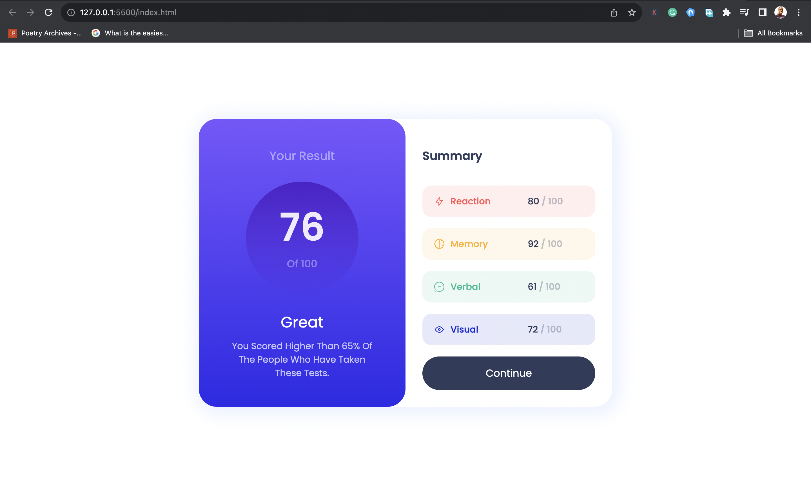

# Frontend Mentor - Results summary component solution

This is a solution to the [Results summary component challenge on Frontend Mentor](https://www.frontendmentor.io/challenges/results-summary-component-CE_K6s0maV). Frontend Mentor challenges help you improve your coding skills by building realistic projects. 

## Table of contents

- [Overview](#overview)
  - [The challenge](#the-challenge)
  - [Screenshot](#screenshot)
  - [Links](#links)
- [My process](#my-process)
  - [Built with](#built-with)
- [Author](#author)
- [Acknowledgments](#acknowledgments)

**Note: Delete this note and update the table of contents based on what sections you keep.**

## Overview

### The challenge

Users should be able to:

- View the optimal layout for the interface depending on their device's screen size
- See hover and focus states for all interactive elements on the page

### Screenshot

### Links

- Solution URL: [Add solution URL here](https://your-solution-url.com)
- Live Site URL: [Add live site URL here](https://your-live-site-url.com)

## My process

### Built with

- Semantic HTML5 markup
- CSS custom properties
- Flexbox
- CSS Grid

## Author

- Website - [Lucky Ekpebe](https://www.your-site.com)
- Frontend Mentor - [@Luckystartech](https://www.frontendmentor.io/profile/Luckystartech)
- Twitter - [@Lucky_Ekpebe](https://twitter.com/Lucky_Ekpebe)

## Acknowledgments

I appreciate the effort and dedication that the FrontendMentors team has put into creating these challenges and providing a platform for continuous learning and growth within the coding community. Your commitment to fostering a collaborative and supportive environment is commendable.

I look forward to taking on more challenges and learning opportunities on FrontendMentors in the future. Thank you for your dedication to the developer community and for being an essential part of my coding journey.
